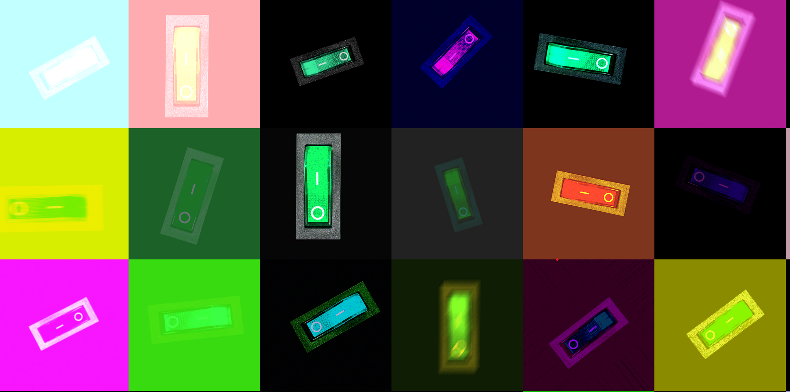
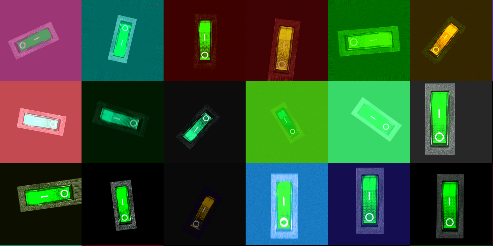
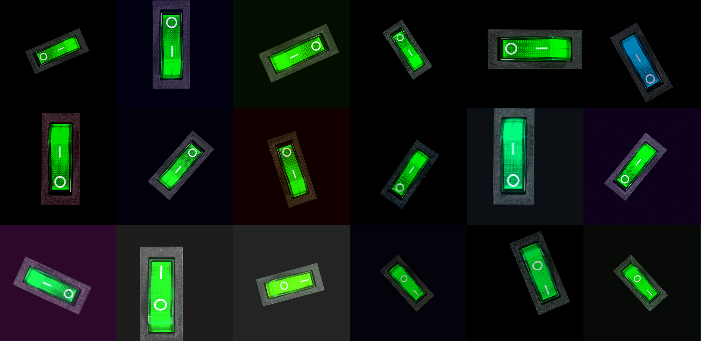
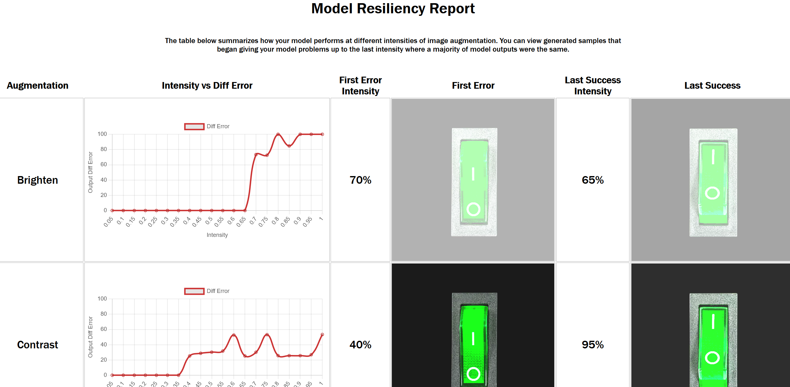
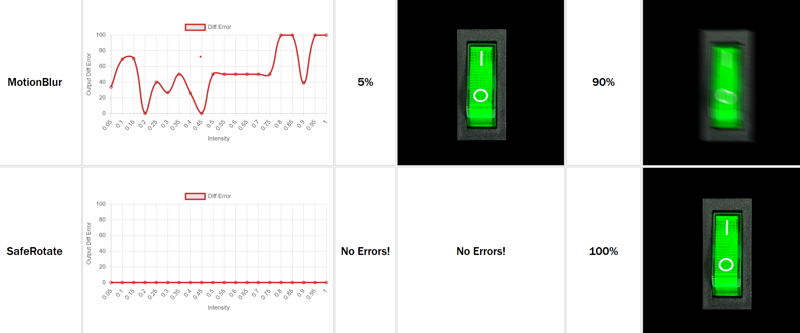

# ml-infinite-image-augment

This 2-in-1 tool analyzes _nearly any_ image-based vision model by testing it in a synthetic world derived from your raw training dataset while never becoming _too_ random. Use analysis results to visually diagnose your model or expand your training/validation set with high quality synthetic mutant images with mutant ground-truths to match.  A single `realism` hyperparameter controls how mutant or realistic fake images should be.

## Tool 1: Generate reasonable synthetics

Some synthetically generated samples at realism=0, 0.5 and 1 respectively:

Model "Hard Mode" fake images (r=0):


Reasonable but not boring (r=0.5):


Very reasonable according to your model (r=1):


## Tool 2: When does my model break?

"What brightness changes my model's output?"

"Is my model rotation invariant?"





The only Python you need to provide at minimum is a `predict(image) -> labels` function used to get model outputs, and works for ANY vision model and MOST label types!  If you allow geometric, pixel shifting image augmentation (ex. rotation) and your labels are based on pixel position, deep support for transforming labels to match augmented images is also supported (ex. rotate segmentation label shapes to match the augmented image's rotation) via the Albumentations library.

In slightly more detail it:

1. Discovers boundries of randomization (How much can I rotate or blur my training set without affecting model output?)
1. Plots how your model reacts to key randomizations at different intensities (What brighness level affects model output across 50% of training samples?)
1. Uses failure boundries to generate "infinite" "un/realistic" datasets that can be used for further training or as an infinite validation set!

## Why use this?

- AutoML-ish selection of image randomization parameters to safely expand any model's training dataset, synthetically and cheaply
- Auto generate synthetic training data that's as realistic or bizarre as your model can tolerate, under 1 hyperparameter.
- Quickly analyze how your model degrades under many common real-world augmentations (blur, motion, rotation...)
- Your model is in Python or can be system called from Python

## Why not use this?

- You're using a deep vision model, there are some really nice differentiable algos to deep learn the best data augmentation strategy for your situation, so you may be better suited to deep ML solutions
- You don't care about how brightness, blur, scale-variance etc. affect your model
- Your model can't be called efficiently from Python

## Step 0: Installation

- Clone this Git repo to your machine
- `pip install -r requirements.txt` to install dependecies with Python >= 3.6 installed.
- Consider running `python example_basic.py` to make sure the lib works correctly.
- Open example_basic.py as a starting template.

## Step 1: Plumbing up your model

Simply instantiate an instance of ImageAugmenter and provide your `predict(image_filename) -> labels` model wrapper function.  This function is typically a shallow lambda wrapper around an ML or opencv `predict(x)` model function and also loads the input image in the model's preferred format.

You can also skip providing a vision model here which will default to a reasonable basic model that detects when randomization bounds for your
dataset is going too far, though it's generally much better to use your own model.  This may be useful if you want to create very generic-yet-reasonable synthetics from your datasets but independent of your model.

### (Optional) Custom label difference calculation

You may also want to specify the 2nd constructor argument `diff_error(augmented_labels, original_labels)` which returns an error value from 0 to 1, with 0 signifying both labels are identical, or 1 meaning they are as mislabeled as possible.  Default behavior is to treat any string-ified difference between them as error=1 and string equality as error=0.  Typically for boolean or categorization it doesn't need modification, whereas a custom lambda for IoU area overlap percentage would be useful for bounding boxes, etc.  The labels' type only has meaning to you (unless you use the `label_format` option) so define it in whatever way lets you easily implement this function.

### (Optional) Support label pixel translation

If your labels contain positional data (bounding boxes, segmentation), you'll need to take care to transform them (ex. rotate labels' segment shapes when a synthetic image is generated by rotating a training image).  This is supported under-the-hood by [Albumentations](https://albumentations.ai/docs/getting_started/bounding_boxes_augmentation/) so you can see what `label_format` you'll need in ImageAugmenter's constructor which will also dictate the shape of labels you might pass to multiple functions (TODO: link to example code that defines handling COCO segmentation labels).

## Step 2: Analyze Randomization Boundries

This step provides clear visibility into what intensity per augmentation degrades your model's performance while also becoming the basis for sane bounds in random data generation.  Running the line below will take a long time depending on options and dataset size but will save its progress as it proceeds to analysis.json for resuming later or use in data generation:

```
from augment import ImageAugmenter

img_aug = ImageAugmenter(on_off_predictor, diff_error=confidence_aware_diff_error)
img_aug.searchRandomizationBoundries(training_img_filenames, training_labels)
```

searchRandomizationBoundries offers plenty of customization (see API section) to focus on only the augmentations your model needs to be resilient to as well as tuning for accuracy vs search speed.  `analyze.json` is used as a resume-cache so delete this file if you ever want to `searchRandomizationBoundries` from scratch.

## Step 2b: (Optional) Visualize Model Resiliency

With the analysis.json file derived you can now render and open [analytics/index.html](analytics/index.html) to view how your model reacts to every augmentation and what intensities start to give your model grief:

```
img_aug.renderBoundries(html_dir="analytics")
```

## Step 3: Generate Infinite Datasets!

After searchRandomizationBoundries completes, you have everything you need to call synthesizeMore in a loop forever! (or run out of disk space):

```
while (True):
    synthetic_img_filenames, synthetic_labels = 
        img_aug.synthesizeMore(training_img_filenames, training_labels)
```

Your training_img_filenames will be traversed in a loop until `count=len(training_img_filenames)` synthetic images are cloned to disk, with each synthetic clone having between `min_random_augmentations=3` and `max_random_augmentations=8` randomizations applied but only up to intensities seen that individually did not affect model output substantially.  If you want to risk exposing your model to training on more extreme datasets such as very bright etc., you can control generating sensible (`realism=0.5`) random augmentation ranges between when small model differences start to show all the way up to values right at the edge (`realism=0`) of where the model starts to fail 100% of the time (ex. _exactly_ too bright for the model). `realism < 0` should be used sparingly as it may worsen realistic cases but _could_ force your model to generalize better.  `realism` near 1 creates very little variation and is best avoided unless you really need very strict realism.  `realism` can also be set on a per-augmentation feature basis via `set_augmentation_realism` which takes top preference.

## Step 4: (Optional) Evaluate Model against freshly generated data

To see how your current or future model (after retraining with synthetic data, of course!) is performing against any batch of synthetic data, you can run the ImageAugmenter's convenience function `evaluate`:

```
print(img_aug.evaluate(synthetic_img_filenames, synthetic_labels))
```

## Step 5: (Optional) Adding to existing project

Other than pip dependencies, everything you need will always and forever live in just the `augment.py` class file, so after prototyping you can easily paste it into any existing project to use as a library.

# ImageAugmenter class API

## ImageAugmenter(my_predict, diff_error, augmentations=ALL_AUGMENTATIONS, label_format=None) class constructor

The main class for grid searching over a training dataset with a model to determine random augmentation limits that the model can tolerate, and store the results.

Returns a JSON blob representing the raw results of each augmentation feature, the same as the contents of `analyze.json`.

`my_predict`: A function that takes an absolute image filename and runs inference against it, returning prediction labels (the labels' type only has meaning to you as long as it's string-ifiable)

`diff_error`: (Optional) Custom error/cost function in the range [0, 1.0] where 0 means both the original unaugmented image labels and augmented image output labels match perfectly or 1 meaning the labels match as little as possible.  Default behavior stringifies both raw and augment labels and assumes zero error only if strings are strictly equal, otherwise 1.

`augmentations`: (Optional) List of augmentation string types to apply for all downstream operations, defaults to all supported augmentations that are mostly 1-to-1 with those provided in the Albumentations library.  You can pick-and-choose each individually if you know your model won't be able to handle certain augmentation types or want to prototype with a smaller/faster feature set.  Available types are:

`label_format`: (Optional) Make dataset synthesis label-type aware so that for example bounding boxes are geometrically transformed to match the augmentations applied to the image.  This option is passed through as-is to the Albumentations library for it to figure out the label transformations, reference [their documentation](https://albumentations.ai/docs/getting_started/bounding_boxes_augmentation/) for supported label formats.  COCO bounding box example: 

#### Augmentation types

##### Color
`Brighten`: Increase brightness


`Contrast`: Increase global contrast

`Darken`: Decrease brightness

`Decontrast`: Decrease global contrast

`Desaturate`: Decrease global image saturation

`Dehue`: Shift global image hue negative

`Hue`: Shift global image hue positive

`LessBlue`: Reduce contribution of Blue channel

`LessGreen`: Reduce contribution of Green channel

`LessRed`: Reduce contribution of Red channel

`MoreBlue`: Reduce contribution of Blue channel

`MoreGreen`: Reduce contribution of Green channel

`MoreRed`: Reduce contribution of Red channel

`Saturate`: Increase global image saturation

##### Distortion
`ElasticTransform`: Randomly stretch the image in 3D

`GaussianBlur`: Increase uniform blur

`MotionBlur`: Increase camera motion blur effect

`SafeRotate`: Rotate the image

`Sharpen`: Sharpen the image

##### Pixel Dropouts
`Downscale`: Lossily reduce image resolution

`MultiplicitiveNoise`: Add random noise to image

`PixelDropout`: Percentage of random pixels to blacken

`RandomSizedCrop`: Crop an ever smaller random rectangle in the image and stretch it to fill the original frame

`Superpixels`: Randomly transplant patches of image elsewhere

### searchRandomizationBoundries(training_img_filenames: list[str], training_labels, step_size_percent: float=0.05)

The main method that examines all training sample images passed in, usually everything you've got.  Because it takes a long time to run, it stores intermediate and final results to `analysis.json` which you can delete manually to find boundries from scratch (ex. you collected more training data and want to re-run). You should generally feed in as many training_img_filenames as possible to strengthen boundry search confidence and ensure future generated data isn't too unrealistic.  On the other hand you may want to limit to ~50000 maximally diverse training samples so analysis completes faster but only if time is a virtue for you.

All other class methods assume you've run this and already computed boundry state.

`training_img_filenames`: List of image filenames that will later be passed to `my_predict`

`training_labels`: List of ground truth labels (type agnostic) that match 1-to-1 with `training_img_filenames`

`step_size_percent`: How big of steps to take when finding an augmentation feature's limit, default of 5 means each trial will increase augmentation intensity by 5% until `my_predict` starts to differ significantly in its output.  Lower values take longer for the 1-time cost of running searchRandomizationBoundries but will yield more accurate augmentation limit boundries for data generation and graphing, so going down to ~1% step_size granularity can sometimes be worth the investment.

`analytics_cache`: The filename to use to store search cache calculations, defaults to analytics.json

## set_augmentation_realism(augmentation_name: str, realism: float)

Override global realism and set for just this augmentation_name. Values close to one add less randomiation, 0 edges to the limit of what your model currently handles, and negative values are wildly random to potentially aid in generalization.

## set_augmentation_weight(augmentation_name: str, weight)

Sets the probability of an augmentation being applied.  weight is relative to other augmentations which are typically 1 (uniform distribution), so a value of 2 would double the odds of selection relative to others while 0.5 cuts in half.

## renderBoundries(html_dir="analytics")

Render the results of `searchRandomizationBoundries` to HTML for easy visualization of how your model performs against varying degrees of augmention.

`html_dir`: (Optional) The directory to write output HTML and image files to, defaults to "analytics" relative directory.

## synthesizeMore(organic_img_filenames, organic_labels, realism=0.5, count=None, min_random_augmentations=3, max_random_augmentations=8, min_predicted_diff_error=0, max_predicted_diff_error=1, output_dir="generated", preview_html="__preview.html")

Generate synthetic training/validation samples based on some input set and only use as much randomization as `realism` demands.  Optionally generates a `__preview.html` file that previews all images in the generated output folder.

`organic_img_filenames`: Original (presumably real-world) training images from which to synthesize new datasets, each image will be used in equal quantity.

`organic_labels` List of ground-truth (presumably real-world) training labels that map 1-to-1 with `organic_img_filenames`.

`realism`: A float between [-∞, 1] to control generated images' realism based on what your model could handle during boundry search.  A value of 1 means to steer clear of more intense random values that your model has trouble with while a value of zero pushes to the very limit of what your model can tolerate.  Negative values push your current model well into failure territory but may be useful to generate synthetic training data for generalization of your model after retraining.

`count`: Number of synthetic images to generate, default of None signifies to use len(training_img_filenames)

`min_random_augmentations`: Randomly pick at least this many augmentations to apply.

`max_random_augmentations`: Randomly pick at most this many augmentations to apply.

`min_predicted_diff_error`: The minimum diff error between `my_predict` running on original image vs augmented image. Set this if you only want to keep generated images that your model fails at to force it to focus on the outliers it misses.  Defaults to zero so all synthesized data is kept.

`max_predicted_diff_error`: The maximum diff error between `my_predict` running on original image vs augmented image.  Set this if you want to filter out images that _may_ differ too wildly from the original image.  Useful for auto-removing images that end up for example too bright for _any_ model to process; such images can potentially weaken the synthetic dataset for training purposes or make validation on synthetics appear artifically poor.  Defaults to 1 so all synthesized data is kept.

`output_dir`: The folder to save images and `__preview.html` to.

`preview_html`: The name of the HTML file that will summarize synthetic images in `output_dir`, defaults to `__preview.html`.  Set to None to disable summarization.

## evaluate(img_filenames, img_labels)

Run `my_predict` against all img_filenames which are typically generated by `synthesizeMore` as well as the matching synthetic truth labels and compare to the model's output labels ran against img_filenames.  This is convenient to test synthetic data against different versions of your model, presumably your model before and after training on the synthetic dataset.  Can also be used to compare real-world vs synthetic model performance.  If your new model performs poorly on a synthetic batch it was trained on, it suggests your `realism` hyperparameter may be too high and you're randomizing training data to the point of mangling it for even the best model (ex. so much extra brightness the image is pure white).  If your model performs extremely well on a synthetic batch it was trained on while retaining real-world accuracy, consider increasing `realism` to handle more real-world edge cases by training on even stranger synthetic samples.  Also consider setting `max_predicted_diff_error` to < 1 to task your model with filtering out overly unrealistic synthetic samples.

`img_filenames`: list of string filenames to use in evaluation.

`img_labels`: The 1-to-1 matching labels of `img_filenames`.

Returns an object containing:

```
{
    "avg_diff_error": Average diff error across all evaluated samples,
    "output_differs_count": Count of outputs that differed from the label significantly,
    "differing_output_errs": All output errors
}
```